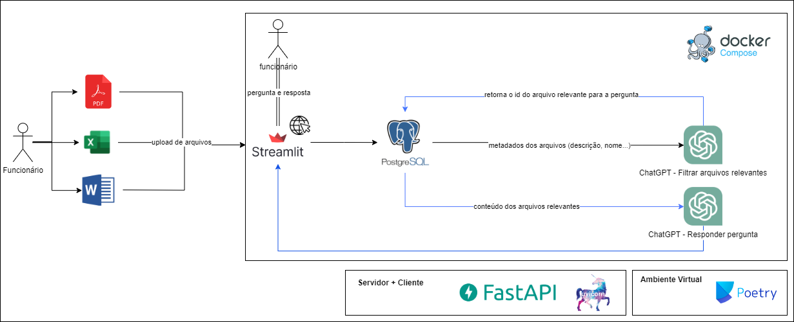

# Projeto Eurofarma



## Tecnologias Utilizadas

- **Python 3.12.1**: Versão do Python utilizada para o desenvolvimento do projeto.
- **Streamlit**: Framework para criação de aplicações web interativas em Python.
- **FastAPI**: Framework moderno e rápido para construção de APIs com Python.
- **Poetry**: Ferramenta de gerenciamento de dependências e empacotamento para projetos Python.
- **Docker**: Plataforma de containerização utilizada para criar ambientes isolados e consistentes para o desenvolvimento e execução da aplicação.
- **PostgreSQL**: Sistema de gerenciamento de banco de dados relacional utilizado para armazenar e gerenciar os dados da aplicação.

## Instalação

1. **Clone o repositório:**

   ```bash
   git clone https://github.com/eduardopelima/eurofarma-chatgpt-project
   cd eurofarma-chatgpt-project

4. **Criando seu arquivo .env**
    <p>Baseado no arquivo ".env-example" presente em cada módulo de nossa aplicação (backend, database e frontend), crie seu próprio arquivo em cada módulo entitulado ".env".</p>

    ```bash
   touch backend/.env

2. **Execute o arquivo docker-compose para subir todos os módulos da aplicação:**
    ```bash
   docker-compose up

8. **Acesse a aplicação web na sua rede local, pelo link: <a href="http://localhost:8501/">http://localhost:8501/<a>**